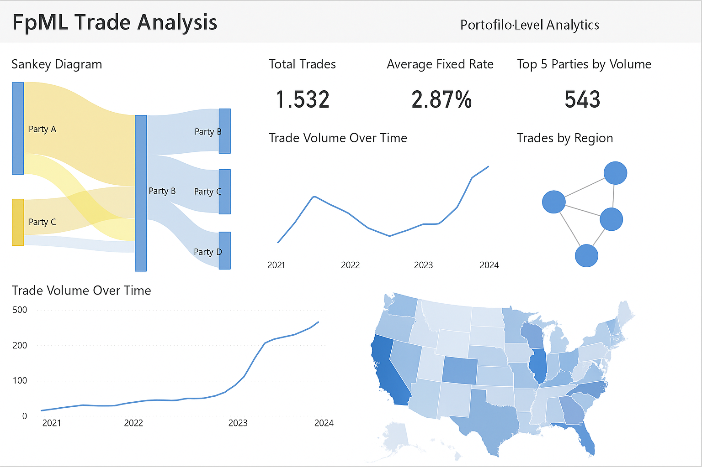

# Power BI UI Implementation Guide
# ---------------------------------
# Data source: SQL/Parquet/CSV with schema like:
# TradeID | TradeDate | BuyerParty | SellerParty | FixedRate | Period | Multiplier | Region (optional)

# ----------------------------
# 1. Import Data to Power BI
# ----------------------------
# Use Power BI Desktop:
# - Home > Get Data > [SQL Server / Parquet / CSV]
# - Load or DirectQuery depending on volume

# ----------------------------
# 2. Data Modeling
# ----------------------------
# - Create dimension tables (if needed):
#   - Date table for time series
#   - Party table (Buyer/Seller details)
# - Create relationships:
#   - Trade[BuyerParty] --> Party[PartyID]
#   - Trade[SellerParty] --> Party[PartyID]

# ----------------------------
# 3. Visualizations
# ----------------------------

# 3.1 Sankey Diagram (Custom Visual)
# - Install from Marketplace: "Sankey Chart by Microsoft BI"
# - Configure:
#   - Source: BuyerParty
#   - Destination: SellerParty
#   - Weight: Count of TradeID or Sum of Notional (if available)
# - Format:
#   - Node color by party type/region
#   - Tooltip: Trade count, avg fixed rate

# 3.2 Network Chart (Custom Visual)
# - Install: "Network Navigator Chart"
# - Configure:
#   - Source: BuyerParty
#   - Target: SellerParty
#   - Node size: Count of Trades
#   - Color: Party type or risk category

# 3.3 Time Series Chart
# - Visual: Line Chart
# - Axis X: TradeDate
# - Axis Y: Count of TradeID
# - Filters: Party, FixedRate range

# 3.4 Geographic Map (if Region data exists)
# - Visual: Map or Filled Map
# - Location: Region or Country from Party metadata
# - Size/Color: Count of Trades or Sum of FixedRate

# 3.5 Histogram / Boxplot
# - Visual: Histogram (use custom visual or column chart)
# - Axis X: FixedRate (binned)
# - Axis Y: Count
# - Tooltip: Party, Period, Multiplier

# 3.6 KPI Cards
# - Total Trades: COUNT(TradeID)
# - Avg Fixed Rate: AVERAGE(FixedRate)
# - Most Active Party: DAX formula with RANKX or MAXX

# 3.7 Filters / Slicers
# - TradeDate Range
# - Buyer/Seller Party
# - Period / Multiplier
# - Fixed Rate Slider

# ----------------------------
# 4. Power BI Theme (Optional)
# ----------------------------
# Import JSON theme:
# - Use color palette: Teal, Navy, Gold, Gray
# - Font: Segoe UI or Roboto

# ----------------------------
# 5. Export / Publish
# ----------------------------
# - Publish to Power BI Service
# - Enable Row-Level Security if needed
# - Use Bookmarks for scenario-based storytelling

# DONE: You now have a scalable Power BI dashboard for FpML Trade Analytics

