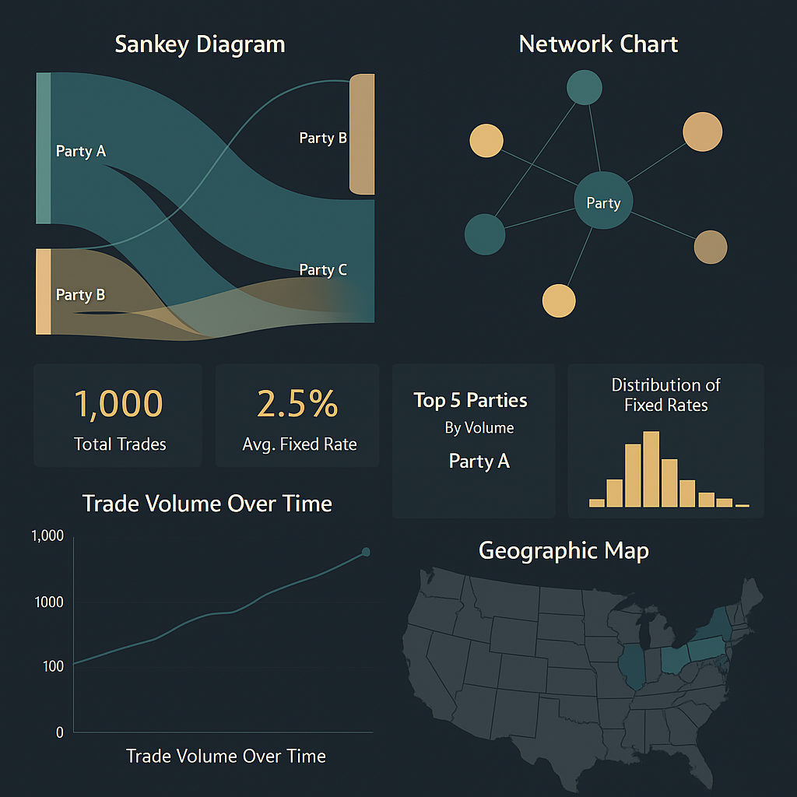

Got it — you're using **AI for the heavy lifting** (parsing, transforming, structuring FpML using XSDs), and Power BI is your **presentation layer**. That's a great architectural split.

Here’s how to create a **fantastic, interactive Power BI UI** specifically for presenting **FpML trade data**.

---

## 🧱 1. **Power BI Data Model Design**

You’ll typically structure your model with star schema principles:

### 💾 Fact Table: `Trades`

\| TradeID | BuyerParty | SellerParty | TradeDate | FixedRate | Period | ProductType |

### 📐 Dimension Tables:

* `Parties` → PartyID, Name, Role, Region, Type
* `Dates` → Date, Month, Quarter, Year
* `Rates` → Rate Band, Category
* `Products` → Product Type, Description

---

## 🧮 2. **Killer Visuals for FpML Presentation**

### 🔁 **Sankey Diagram** (custom visual)

* **From**: Buyer
* **To**: Seller
* **Weight**: Count of trades or notional
* Use to show trade flows.

### 🌐 **Network Chart**

* Shows relationships between counterparties
* Highlights party centrality (degree of connectedness)

### 📈 **Time-Series Trend**

* Trade volume or notional over time
* Use slicers to filter by party/product

### 🎯 **KPI Cards**

* Total trades
* Avg. fixed rate
* Top 5 parties by volume

### 📊 **Histogram / Boxplot**

* Distribution of fixed rates
* Outlier detection

### 🧭 **Geographic Map**

* Region-wise trade breakdown (from party metadata)

---

## 🎨 3. **Visual Design Tips**

| Element           | Best Practice                                               |
| ----------------- | ----------------------------------------------------------- |
| **Color palette** | Use finance-safe, modern palette (navy, grey, teal, gold)   |
| **Themes**        | Use custom JSON theme or import from PowerBI.Tips           |
| **Fonts**         | Use Segoe UI, Source Sans Pro, or Roboto                    |
| **Layout**        | Dashboard grid layout, cards on top, visuals below          |
| **Interactions**  | Enable drill-through on party, product                      |
| **Tooltips**      | Custom tooltips with XML snippet on hover (for each trade)  |
| **Bookmarks**     | For scenarios like "Top Counterparties", "Anomalous Trades" |

---

## 🤖 4. Enhancing With AI Copilot (Optional)

You can now ask Power BI questions like:

> *“Show all trades with a fixed rate above 4% involving Party X in Q2 2024.”*

Use:

* **Smart narrative visual**
* **Q\&A visual**
* **AI Insights** for detecting patterns

---

## ✅ Final Touches

* Add **navigation panel** with icons
* Use **page tooltips** for trade drill-ins
* Group visuals with buttons for **scenario walkthroughs** (e.g., “Stress Test View”, “Counterparty Risk View”)

---

Would you like a **sample Power BI design layout** or a `.pbix` mockup file with placeholders for your AI-transformed FpML data?

